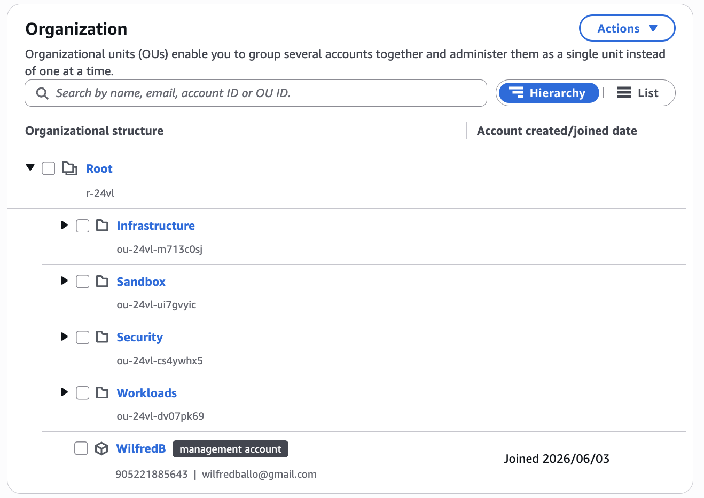
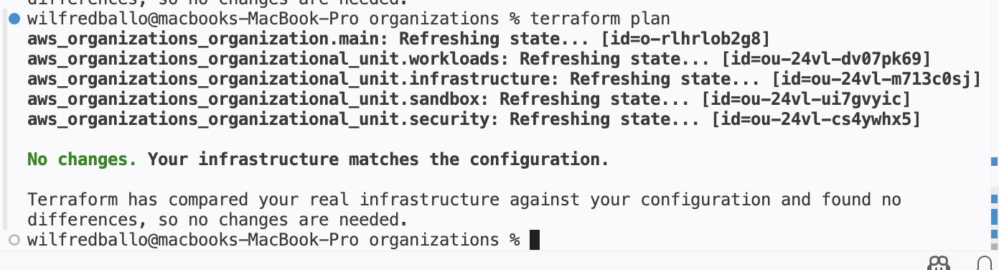
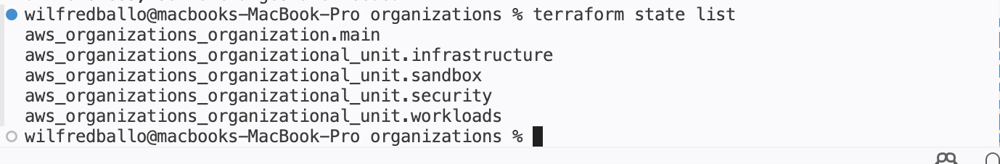

# AWS Secure Landing Zone with Terraform + Migration + FinOps Platform

## Overview

This project builds the foundation of a secure AWS multi-account environment using Terraform and AWS Organizations.

The landing zone creates a scalable organizational structure that separates workloads by function and provides a foundation for governance, security controls, logging, and future account provisioning.

## Architecture

AWS Organization
├── Security OU
├── Infrastructure OU
├── Sandbox OU
└── Workloads OU

## Technologies Used

- AWS Organizations
- Terraform
- AWS IAM
- GitHub
- GitHub Actions (planned)
- AWS Config (planned)
- AWS CloudTrail (planned)
- AWS GuardDuty (planned)

## Features Implemented

- AWS Organization managed with Terraform
- Infrastructure Organizational Unit
- Security Organizational Unit
- Sandbox Organizational Unit
- Workloads Organizational Unit
- Terraform state management
- Infrastructure import and reconciliation
- Git version control

## Evidence

### Organizational Structure



### Terraform Validation



### Terraform State



## Terraform Commands

```bash
terraform init
terraform plan
terraform apply
terraform state list
terraform state pull
```

## Project Status

Phase 1 Complete

Current State:
- AWS Organization deployed
- Organizational Units deployed
- Terraform state reconciled
- Infrastructure managed through Terraform

🚧 Phase 2 – Enterprise Landing Zone Expansion

Governance & Security
- SCPs
- CloudTrail
- AWS Config
- GuardDuty
- Security Account

Migration
- AWS MGN
- AWS DMS
- Migration Hub
- Migration Runbook

FinOps
- AWS Budgets
- Cost Explorer
- Cost Allocation Tags
- Cost Dashboards

Operations
- CloudWatch Monitoring
- SNS Alerting

Automation
- GitHub Actions
- Terraform CI/CD

## Repository Structure

```text
.
├── backend.tf
├── main.tf
├── outputs.tf
├── provider.tf
├── variables.tf
├── screenshots/
└── README.md
```

## Author

Wilfred Ballo
Cloud Engineer | Terraform | AWS | Security
