# AWS Secure Landing Zone with Terraform + Migration + FinOps Platform

## Overview

This project builds the foundation of a secure AWS multi-account environment using Terraform and AWS Organizations.

The landing zone creates a scalable organizational structure that separates workloads by function and provides a foundation for governance, security controls, logging, and future account provisioning.

## Architecture

AWS Organization
│
├── Management Account
│
└── Sandbox OU
      │
      └── Member Account

CloudTrail (Org Trail)
        │
        ▼
   S3 Log Bucket

GuardDuty
        │
        ▼
   Security Findings

Security Hub
        │
        ▼
 Consolidated Findings

Inspector
        │
        ▼
 Vulnerability Findings

Terraform
        │
        ├── Organizations
        ├── SCPs
        ├── Logging
        └── GuardDuty

## Business Value

This landing zone provides:

- Centralized governance
- Organization-wide audit logging
- Threat detection
- Security posture management
- Terraform-managed infrastructure
- Scalable multi-account AWS foundation

## Technologies Used

- AWS Organizations
- Terraform
- AWS IAM
- GitHub
- GitHub Actions (planned)
- AWS Config (planned)
- AWS CloudTrail (planned)
- AWS GuardDuty (planned)

## Skills Demonstrated

- AWS Organizations
- Service Control Policies (SCPs)
- CloudTrail
- GuardDuty
- Security Hub
- Amazon Inspector
- Terraform
- Infrastructure as Code
- AWS Security Governance
- Multi-Account Strategy

## Features Implemented

- AWS Organization managed with Terraform
- Infrastructure Organizational Unit
- Security Organizational Unit
- Sandbox Organizational Unit
- Workloads Organizational Unit
- Terraform state management
- Infrastructure import and reconciliation
- Git version control


## Evidence

### AWS Organizations

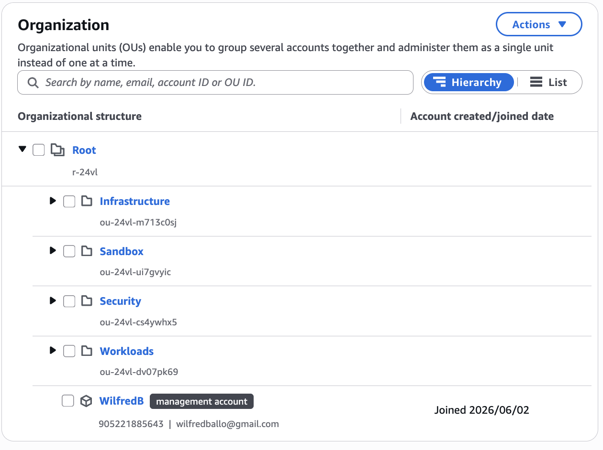

### Service Control Policies (SCPs)

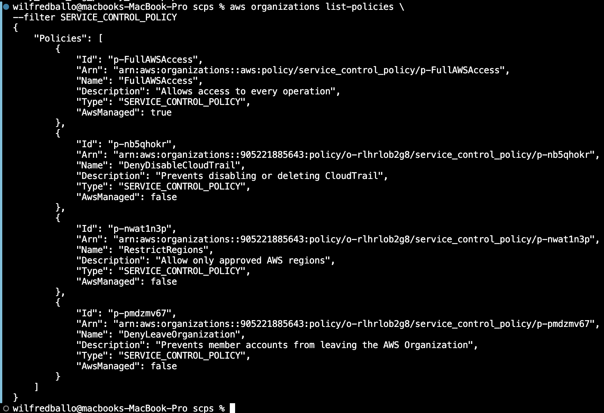

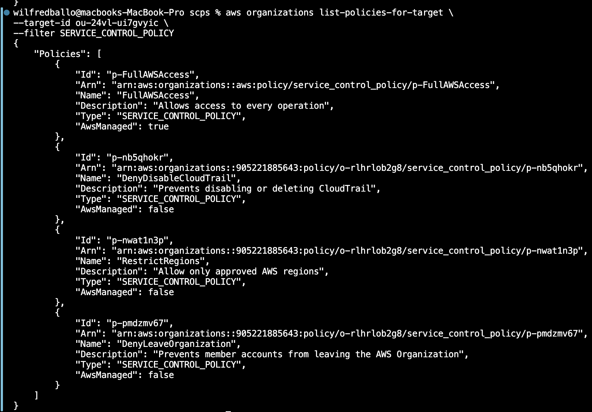

### Organization CloudTrail

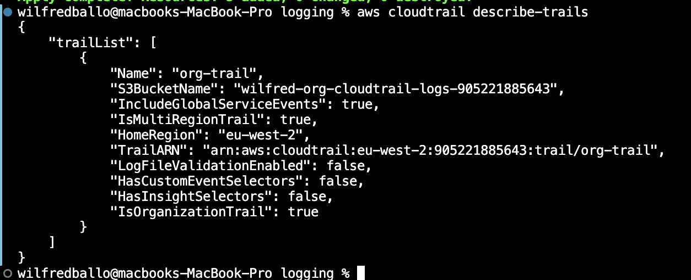

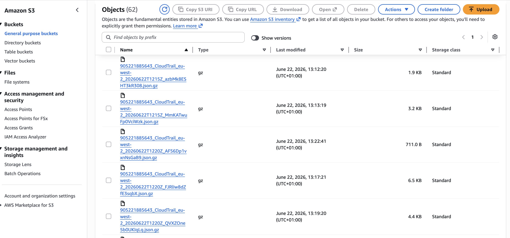

### GuardDuty

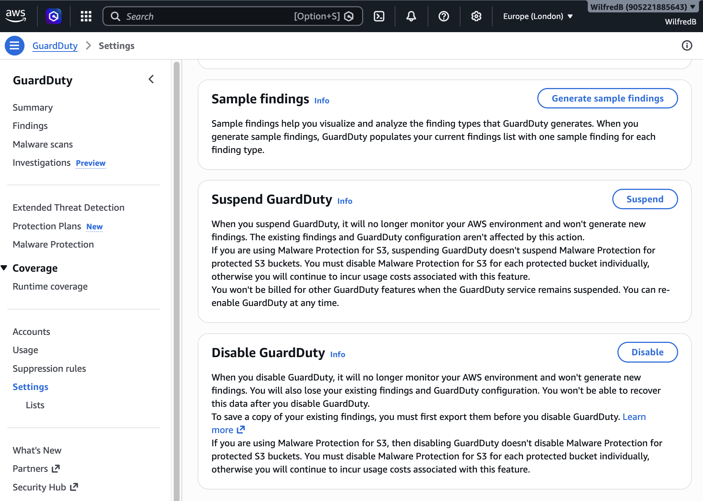

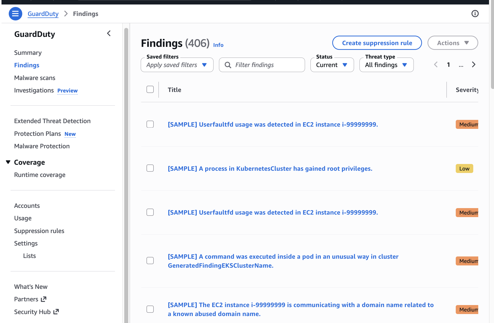

### Security Hub

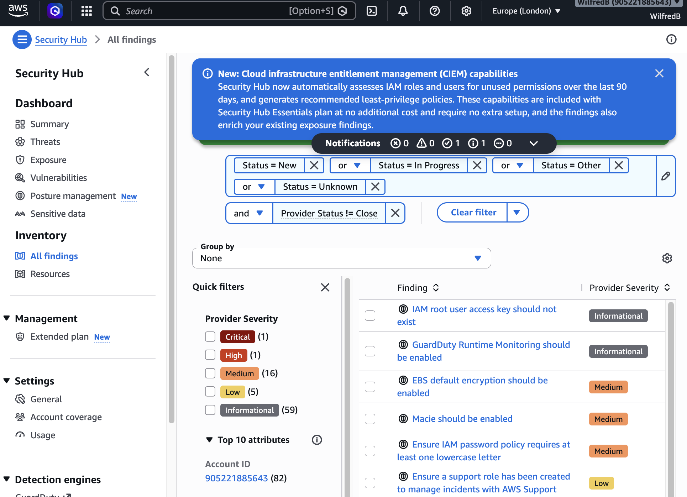

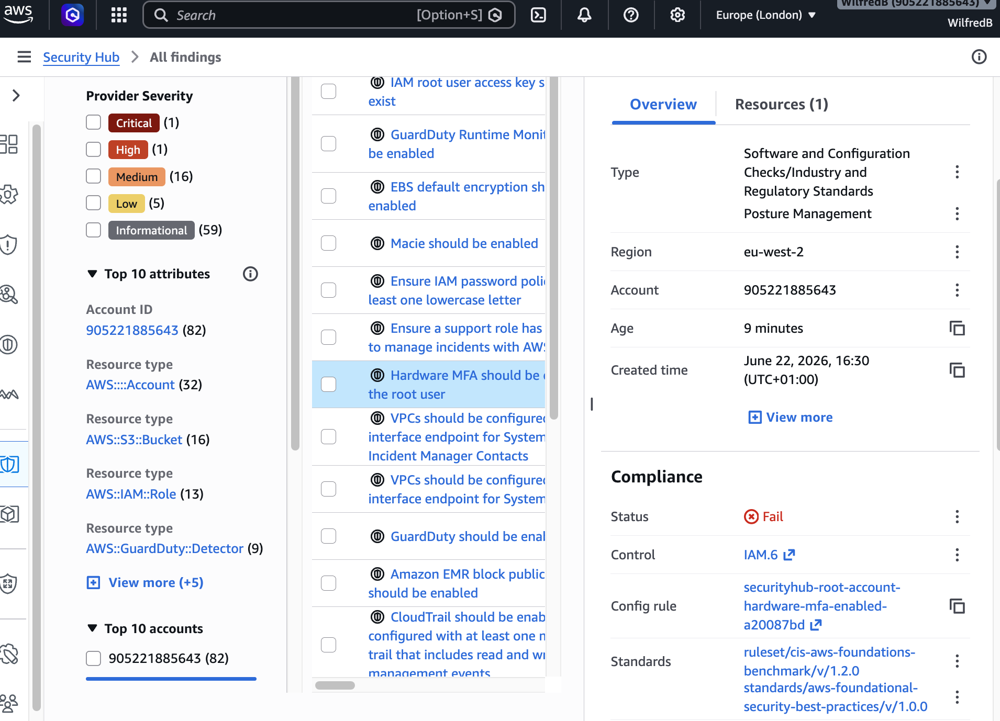

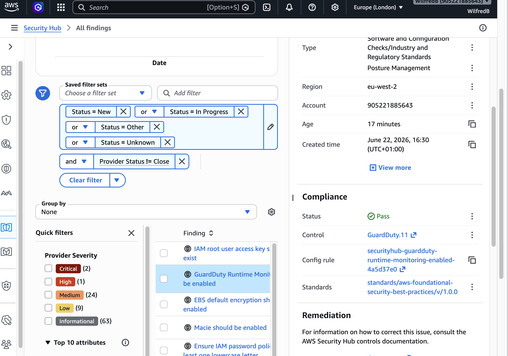

### Amazon Inspector

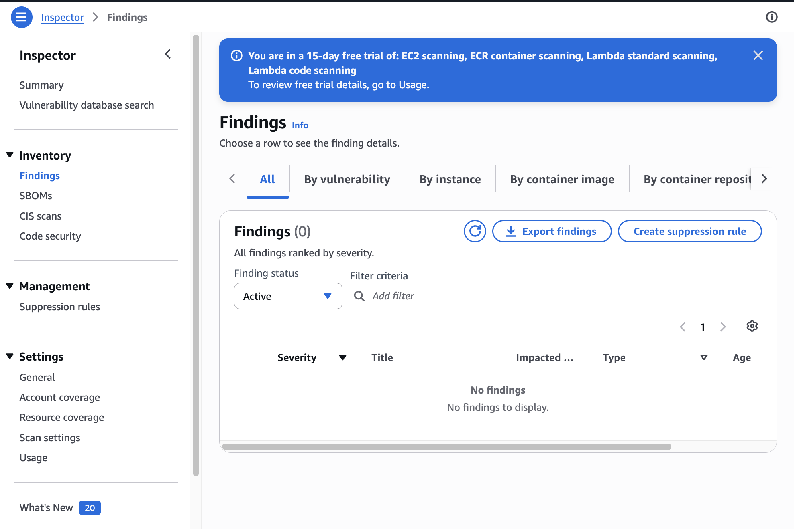

### Service Control Policies (SCPs)

#### SCP Policies Created


#### SCPs Attached to Sandbox OU


## Terraform Commands

```bash
terraform init
terraform plan
terraform apply
terraform state list
terraform state pull
```

## Project Status

Phase 1 Complete

Current State:
- AWS Organization deployed
- Organizational Units deployed
- Terraform state reconciled
- Infrastructure managed through Terraform

🚧 Phase 2 – Enterprise Landing Zone Expansion

Governance & Security
- SCPs
- CloudTrail
- AWS Config
- GuardDuty
- Security Account

Migration
- AWS MGN
- AWS DMS
- Migration Hub
- Migration Runbook

FinOps
- AWS Budgets
- Cost Explorer
- Cost Allocation Tags
- Cost Dashboards

Operations
- CloudWatch Monitoring
- SNS Alerting

Automation
- GitHub Actions
- Terraform CI/CD

Estimated Monthly Cost

This project was built using AWS Free Tier and low-cost services.

All resources can be destroyed with Terraform when no longer required.

## Repository Structure

```text
.
├── backend.tf
├── main.tf
├── outputs.tf
├── provider.tf
├── variables.tf
├── screenshots/
└── README.md
```

## Author

Wilfred Ballo
Cloud Engineer | Terraform | AWS | Security
